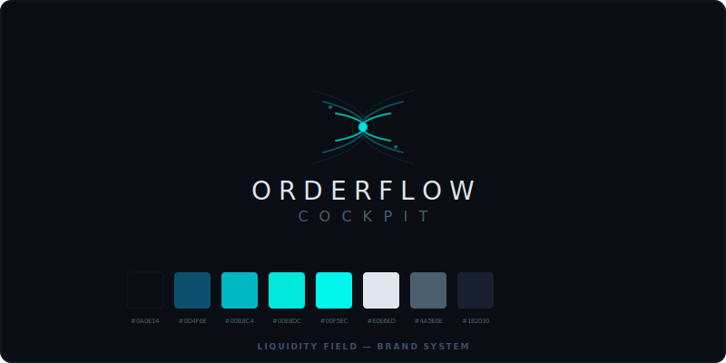

# Orderflow Cockpit

<p align="center">
  
</p>

**Real-time market microstructure visualization dashboard.**

Orderflow Cockpit reveals what ordinary charts do not show: hidden liquidity, order flow pressure, aggressive trades, depth imbalances, and live market microstructure — all streamed through Binance Futures public WebSockets.

> **Decision-support visualization only.** No trading signals. No AI predictions. No automated trading. No financial advice.

---

## Positioning

| What it is | What it is not |
|------------|----------------|
| Real-time order flow visualization | A trading bot |
| Decision-support dashboard | A buy/sell signal generator |
| Market microstructure perception | An AI prediction system |
| Professional data visualization tool | A crypto influencer dashboard |

---

## Features

- **Unified execution chart** — Custom Canvas2D rendering engine with native zoom/pan, candlesticks, orderflow overlays (heatmap, bubbles, footprint, state badges)
- **Live candles** — Real-time candlestick chart with footprint-style buy/sell volume at each price level
- **Live trades & bubbles** — Aggressive large-print detection with state classification (PENDING → ACCEPTED/REJECTED/ABSORBED/EXHAUSTED/RESISTANCE)
- **Local order book & heatmap** — L2 depth visualization with quantity labels, spread indicator, and stale-data indication
- **Footprint/orderflow** — Per-candle price-level delta visualization
- **Strict order book sync** — Binance diff-depth methodology with DEGRADED depth20 fallback, timeout protection, DEBUG_BOOK diagnostics
- **Smart Flow bubbles** — Automatic large-trade bubble rendering with cluster enrichment, no mode switching needed
- **Symbol switching** — Switch between BTCUSDT, ETHUSDT, SOLUSDT, and 20+ Binance Futures perpetuals
- **Connection health** — Per-stream status (trade, depth, ticker) with honest stale/error indication
- **Chart interaction** — Deep zoom, smooth pan, price-axis scaling, time-axis compression, LIVE/GO LIVE pill
- **Bubble hover tooltip** — Inspect aggressive flow events by hovering over bubbles
- **Demo mode** — Simulated market data for offline testing

---

## What This Demonstrates (Portfolio)

- **Real-time WebSocket lifecycle management** — Generation tokens, exponential backoff, stale-socket detection, and clean teardown across multiple parallel streams
- **Canvas2D rendering under live market conditions** — High-frequency overlay rendering (bubbles, heatmap, footprint, tooltips) without frame drops
- **Order book / depth visualization** — Local L2 book reconstruction from diff-depth streams with sequence validation and automatic resync
- **React/TypeScript architecture** — Zustand state management optimized for market microstructure data (refs, subscriptions, no unnecessary re-renders)
- **Professional trading-dashboard UI** — Dark terminal aesthetic with teal/cyan accents, dense but organized panels, live status indicators
- **Frontend data visualization** — Translating raw WebSocket messages into actionable visual information in real time

---

## Tech Stack

- React 18 + TypeScript
- Vite
- Zustand (state management)
- Custom Canvas2D rendering engine (chartRenderer.ts)
- Binance Futures public WebSockets (no API keys required)

## Local Setup

```bash
git clone https://github.com/ShrPaw/orderflow-cockpit.git
cd orderflow-cockpit
npm install
npm run dev
```

Open the URL printed by Vite (typically `http://localhost:5173`).

### Production Build

```bash
npm run build
npm run preview
```

## No API Keys Required

The app connects to Binance Futures public WebSocket streams. No exchange account, API key, or authentication is needed. All data is public market data.

## Debug Flags

- `localStorage.setItem('DEBUG_OVERLAY', '1')` — Show overlay diagnostics on chart
- `localStorage.setItem('DEBUG_BOOK', '1')` — Log order book sync state transitions and critical events

## Manual QA Checklist

- [ ] `npm install` succeeds
- [ ] `npm run build` passes with 0 errors
- [ ] `npm run dev` starts the app
- [ ] BTCUSDT loads with live trades, depth, and ticker
- [ ] No reconnect spam in browser console
- [ ] Chart zooms in deeply enough to inspect individual candles
- [ ] Pan away from live edge — GO LIVE pill appears
- [ ] Click GO LIVE or press Home — returns to live edge
- [ ] Hover over a bubble — tooltip shows side/state/notional/price/age
- [ ] Heatmap shows liquidity bands with quantity labels
- [ ] Switch BTCUSDT → ETHUSDT — old data clears, new data streams
- [ ] Stale order book is honestly indicated (dimmed + warning)
- [ ] No duplicate WebSocket connections
- [ ] Browser refresh starts clean

## Known Limitations

- Depends on Binance public stream availability — if Binance blocks or rate-limits the IP, streams will reconnect with backoff
- Browser/network/firewall may affect WebSocket connectivity
- Not financial advice — this is a visualization tool only
- Not a trading bot — no orders are placed, no trades are executed
- Local visualization only — no server-side persistence or historical database
- aggTrade is aggregated trade data, not full tick-by-tick execution data
- Depth stream is top-20 levels at 100ms intervals, not full order book

## Architecture

See [docs/ARCHITECTURE.md](docs/ARCHITECTURE.md) for detailed architecture documentation.

## License

Private project — not for redistribution.
